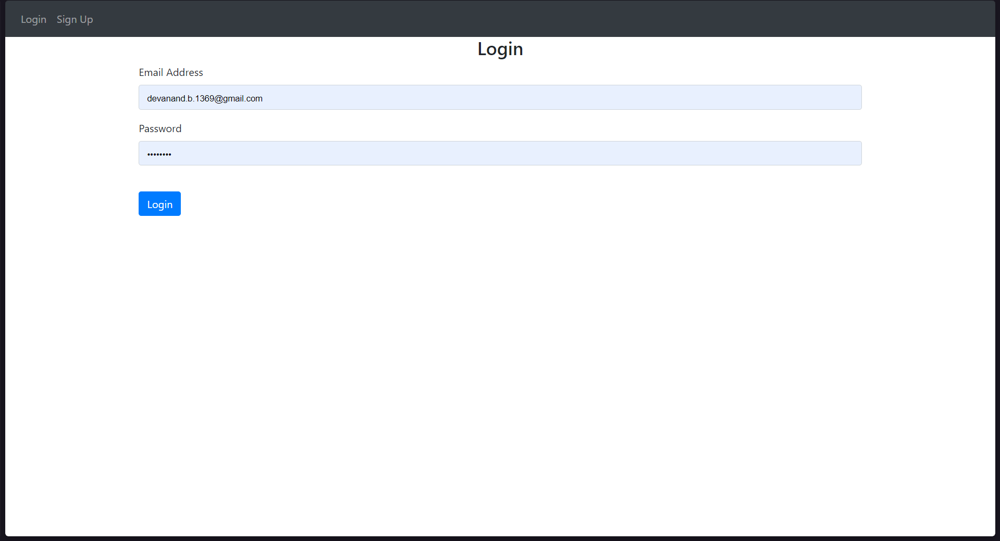
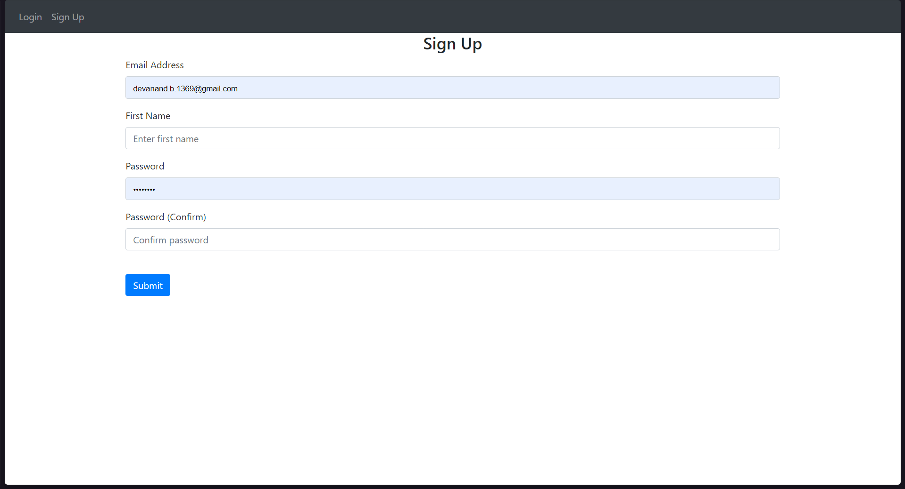
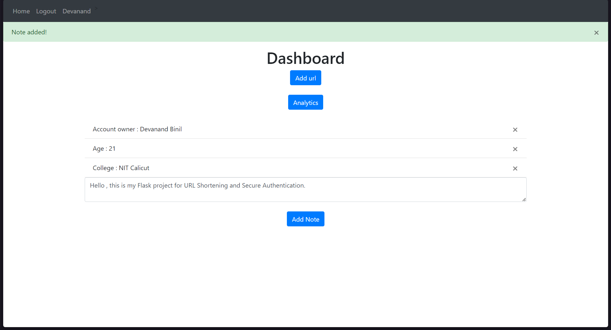
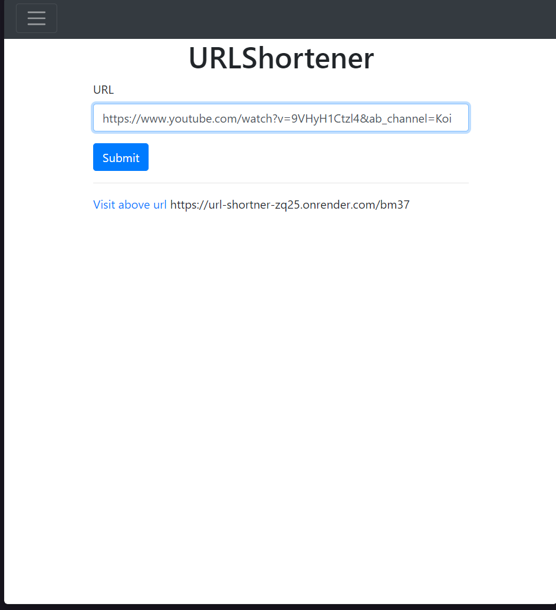
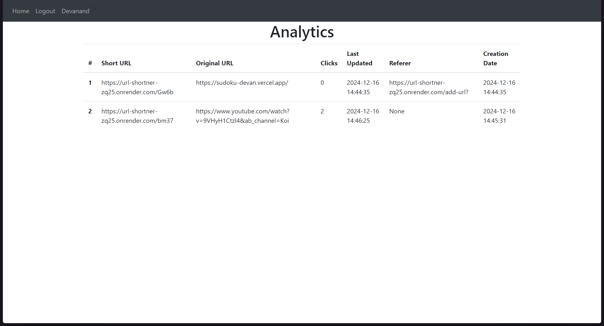

# URL Shortner

## Overview
This URL Shortner is built using **Flask**, offering a secure and user-friendly platform for managing URL redirections with analytics and additional features. The application ensures data integrity and security through encryption and hashing mechanisms while providing a seamless dashboard experience.

## Features

1. **User Authentication**  
   - Login system with real-time alerts and validation.  
   - User credentials are encrypted and hashed using robust algorithms before being stored in an SQL database.

2. **Dashboard**  
   - **Add URL**: Add a new URL for redirection.  
   - **View Analytics**: View details such as:
     - Short URL.  
     - Long URL.  
     - Date of addition.  
     - Number of clicks.  
   - **Add Notes**: A unique feature allowing users to save custom notes for each URL.

## Technical Details

- **Framework**: Flask (Python-based lightweight web framework).  
- **Database**: SQL-based database for secure data storage.  
- **Data Security**:
  - Data encryption using industry-standard algorithms.  
  - Passwords are hashed to enhance security.
- **Frontend**: HTML, CSS, and JavaScript for a responsive and interactive user interface.
- **Backend**: Python with Flask to handle server-side logic.  
- **Libraries Used**:
  - Flask-WTF for form handling and validation.  
  - SQLAlchemy for database interactions.  
  - Bcrypt for hashing passwords.

## Installation

1. Clone the repository using:
   ```bash
   git clone https://github.com/Devanand-Binil/url-shortner.git
   ```

2. Change directory into the project using:
   ```bash
   cd url-shortner/
   ```

3. Create a virtual environment and install dependencies:
   ```bash
   python -m venv env

   source ./env/bin/Activate  # If on Linux

   .\env\Scripts\activate.bat  # On Windows

   pip install -r requirements.txt
   ```

4. Run the app using:
   ```bash
   python main.py
   ```

## Usage

- Register and log in to access the dashboard.
- Add URLs for redirection and manage them with ease.
- View analytics to track the performance of your URLs.
- Save custom notes for personalized URL management.

## Deployment

You can access the deployed application [URL Shortner](https://url-shortner-zq25.onrender.com/).
Please wait for 30 sec and reload . The website might have cycled down to cold storage 


## Contributing

Contributions are welcome! Please fork the repository, create a feature branch, and submit a pull request.

## License

This project is licensed under the MIT License. See the LICENSE file for details.

## Screenshots

   
    
   
   
   

---

